Install JupyterLab on Windows
=============================

.. note:: Installation steps assume that you have administrator rights on your system. 
    If you don’t have administrator rights, follow the steps without selecting “for all users” 
    options and install software packages to your user account only.
        

Install Python
^^^^^^^^^^^^^^

**Skip this step if you have Python 3.x already installed on your system.**

1. Open your web browser and go to https://www.python.org/

2. Click ``Downloads`` on the top menu and click ``Python 3.9.7`` button.

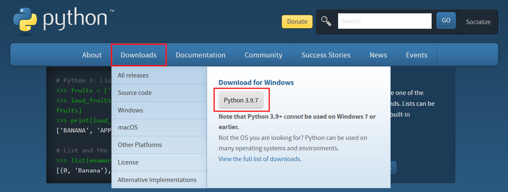

3. Save installation file.

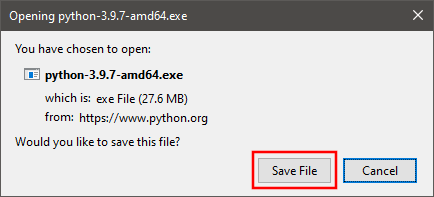

4. Run installation file.

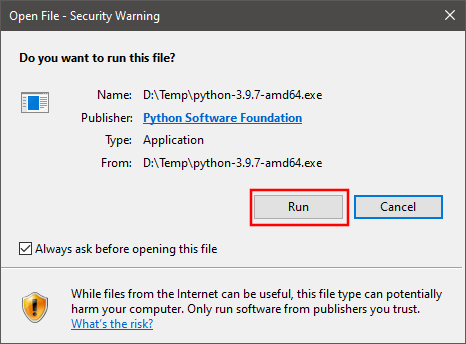

5. You can choose ``Install Now`` option to complete installation with default options. For the suggested custom installation please follow steps 6 – 8.

6. Check ``Install launcher for all users`` and ``Add Python 3.9 to PATH``  boxes. Click ``Customize Installation``.

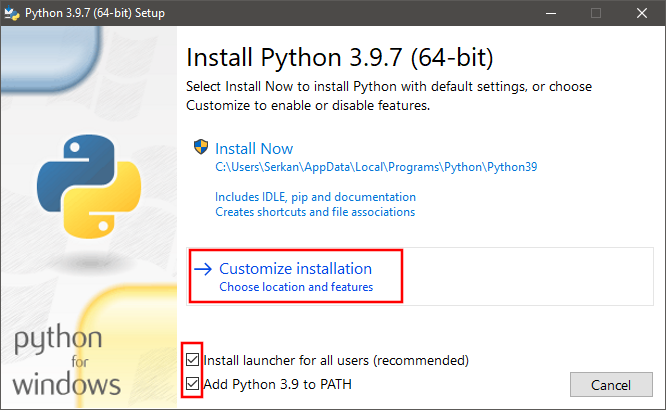

7. Uncheck ``Documentation``, ``tcl/tk and IDLE``, and ``Python test suite`` options. Check ``pip``, ``py launcher``, and ``for all users`` options. Click ``Next``.

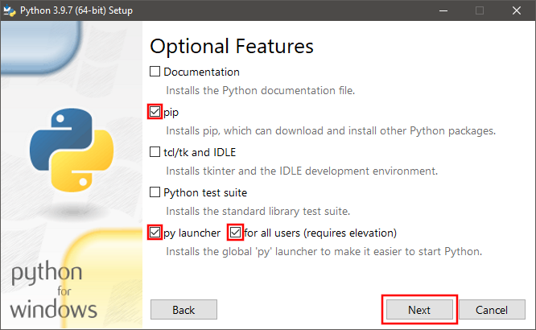

8. Check ``Install for all users``, ``Associate files with Python``, ``Create shortcuts for installed applications``, ``Add Python to environment variables``, 
and ``Precompile standard library`` options. Uncheck  ``Download debugging symbols`` and ``Download debug binaries`` options. Click ``Install``.

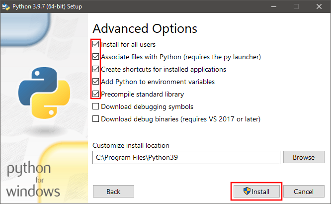

9. Once installation is finished, open a command prompt and test ``Python`` by entering python
command. Python command line interface should be available with >>> prompt.

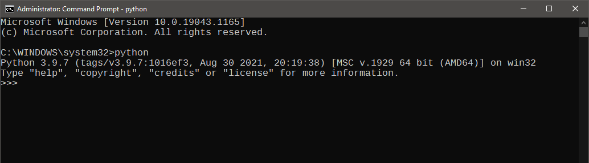

Install node.js
^^^^^^^^^^^^^^^

**Skip this step if you have node.js 14.x or newer already installed on your system.**

.. note:: Installation steps assume that you have administrator rights on your system. 
    If you don’t have administrator rights, follow the steps without selecting “for all users” 
    options and install software packages to your user account only.

1. Open your web browser and go to https://nodejs.org/en/

2. Click LTS (Long Term Support) version ``download`` button.

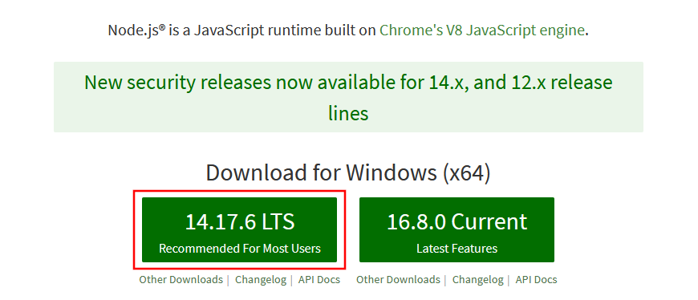

3. Save installation file.

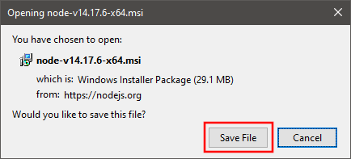

4. Run installation file.
   
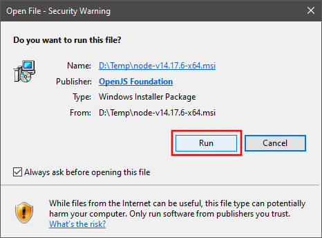

5. Complete installation by following the wizard accepting the terms and the default options.

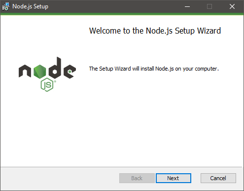
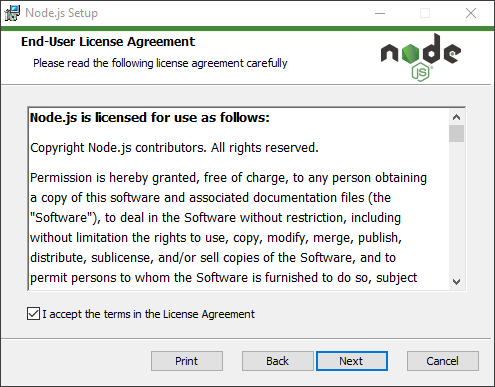

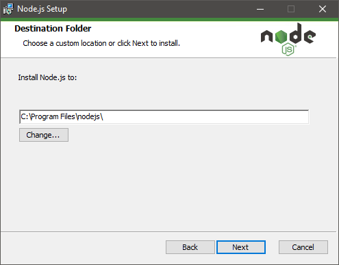
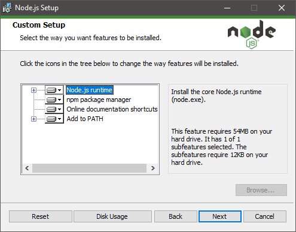

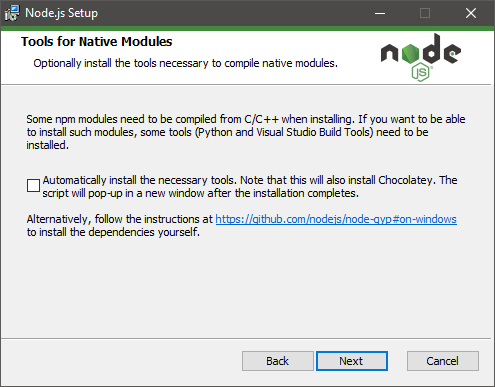
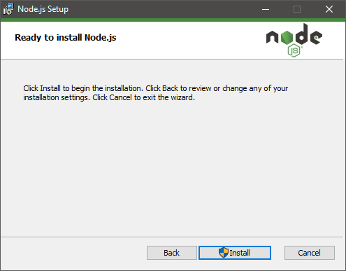

6. Once installation is finished, open a command prompt and test node.js by entering npm
command. Help on its usage should be displayed.

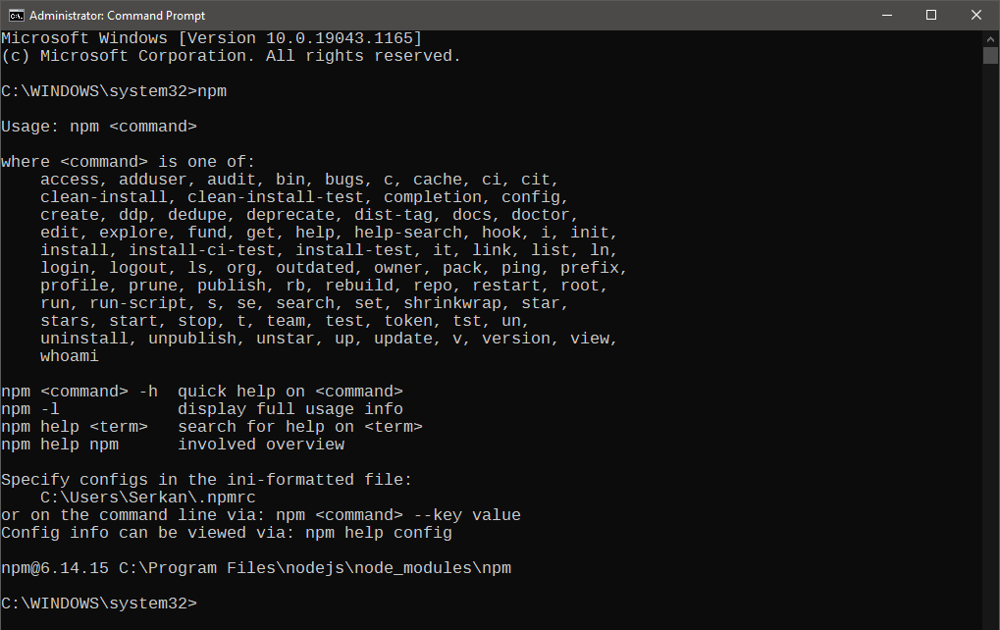

Install JupyterLab
^^^^^^^^^^^^^^^^^^

1. Open a command prompt and enter ``pip install jupyterlab`` command.

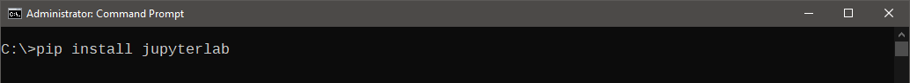

2. Python package manager (pip) will install JupyterLab and all other required packages.

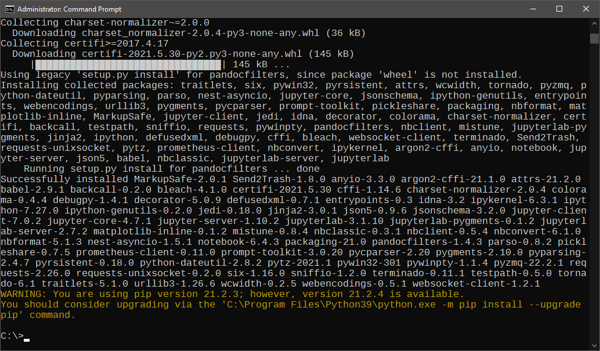

3. Once installation is finished, enter ``jupyter lab`` command to start JupyterLab.

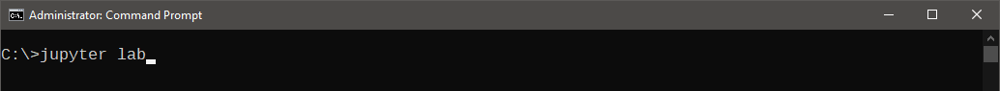

4. By default, JupyterLab automatically opens a web browser tab to display the user interface.

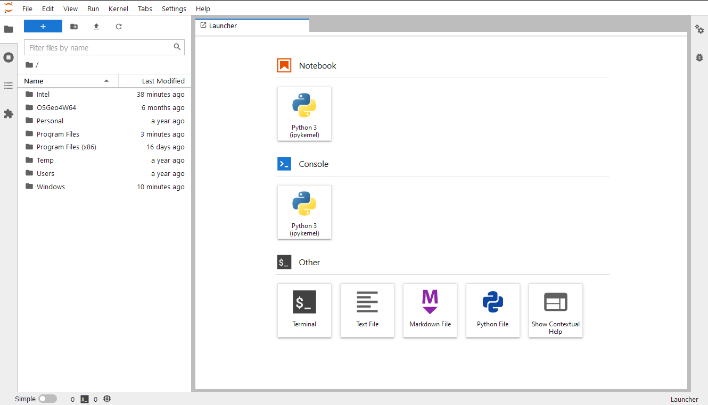

5. JupyterLab will also display some information on the terminal, including the URL address to
access the user interface. You can **copy-paste the URL address** to your web browser to access
the user interface if it is not displayed automatically.

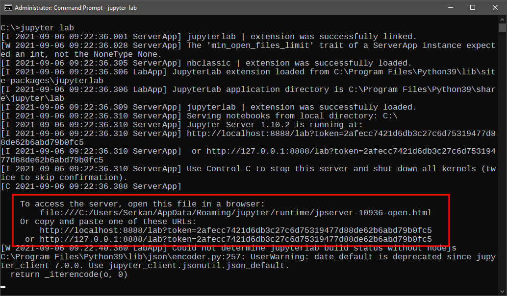

6. Enjoy your JupyterLab!