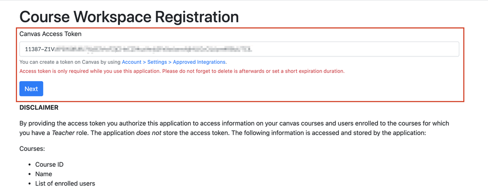
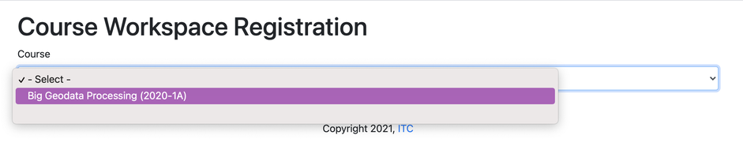
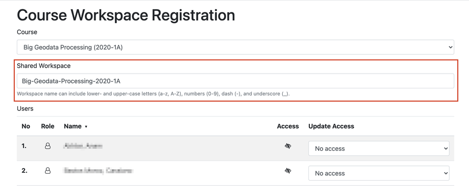
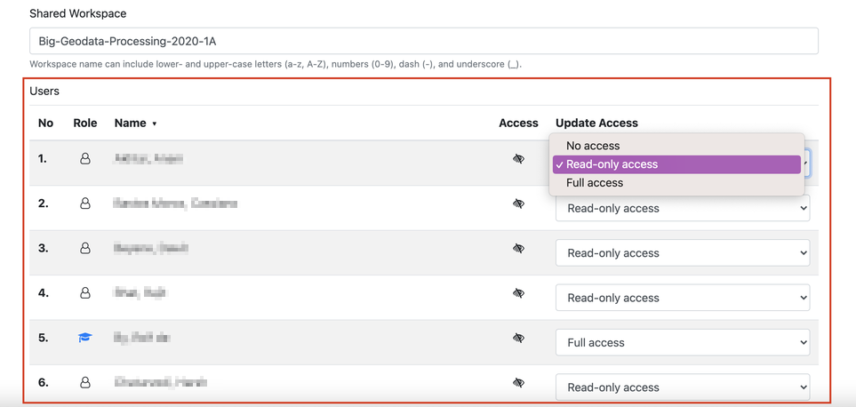
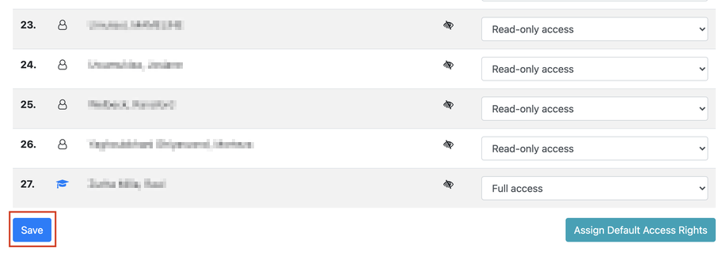
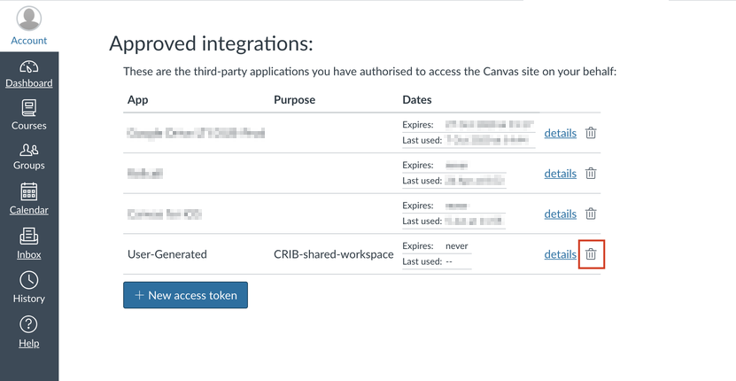

Create shared workspace
================================

This is a step-by-step guide for creating a shared workspace and granting access to it for others 
using the web app `crib.utwente.nl/gcp-canvas <https://crib.utwente.nl/gcp-canvas/>`_. The shared 
workspace can be shared with teachers, TAs, and students. For most steps there will be a visual 
example provided so pay attention to a red square as it will highlight the elements important to 
the step. 

1. First off, open the web app `crib.utwente.nl/gcp-canvas <https://crib.utwente.nl/gcp-canvas/>`_.

2. Then, in Canvas, you will have to generate an access token. This token will allow the web app 
   to collect information about courses for which you have a "Teacher" role. To do this, go to 
   `canvas.utwente.nl/profile/settings <https://canvas.utwente.nl/profile/settings>`_ and scroll down until you see a button ``New access token``. 

    .. image:: images/step-2-1.png

   Once the button is pressed, you will be presented with inputs for ``purpose`` and ``expires``. 
   For ``purpose`` you may enter 'CRIB-shared-workspace', and for ``expires`` select the next day since the 
   token is only needed during the use of the web app. Press the button ``Generate token``, then copy 
   and save the token since it won't possible to get it again once you leave the page.

   .. image:: images/step-2-2.png

3. Now, in the web app, paste the Canvas access token in the text box and press the button ``Next``.

4. You will be presented with a list of courses. From this list, select the course for which you wish to create a shared workspace.

5. Enter the name of the workspace. Under the course list there is an input where you can write the name of your shared workspace. A name will already be suggested for you but you can, of course, change it.

6. Set access rights for each person. Under the workspace name input, there is a ``Users`` table that 
   contains persons that are involved in the selected course. In the column ``Update Access``, you can 
   set the access rights for the respective person. There are three types of rights:

   * **No access** means that the person won't be able to access the shared workspace at all.
   * **Read-only access** only allows viewing files and folders within the shared workspace.
   * **Full access** permits the person to view and edit any file and folder within the shared workspace.

   To make updating access rights quicker, you can use the following two features. Firstly, you 
   can sort the table by clicking on any of the headers. For example, if you want to sort by roles 
   to get all the teachers and TAs at the top, click on the ``Role`` header twice. Initially, the table 
   is sorted with students on top, then, after the second click, the table is sorted with teachers 
   and TAs at the top. The same way you can sort by ``Number``, ``Name``, and ``Access``. Secondly, it is possible 
   to assign default rights to all people with unassigned (i.e. no access) access rights by clicking 
   the button ``Assign Default Access Rights`` under the ``Users`` table. When selected, students and observers 
   will have read-only access while teachers, TAs, and designers will have full access.

7. Create the workspace. Once you have entered the workspace name and selected the access rights 
   for each person, you can create the workspace by clicking ``Save`` button which is located under 
   the ``Users`` table. Next time you or other enrolled people login to the system, the shared workspace 
   will be visible under the ``shared`` folder.

8. Finally, you should delete the access token you generated in step 2. To do this go to 
   `canvas.utwente.nl/profile/settings <https://canvas.utwente.nl/profile/settings>`_ and scroll 
   down to section ``Approved integrations``. There, you can delete the token by clicking on the bin icon.

